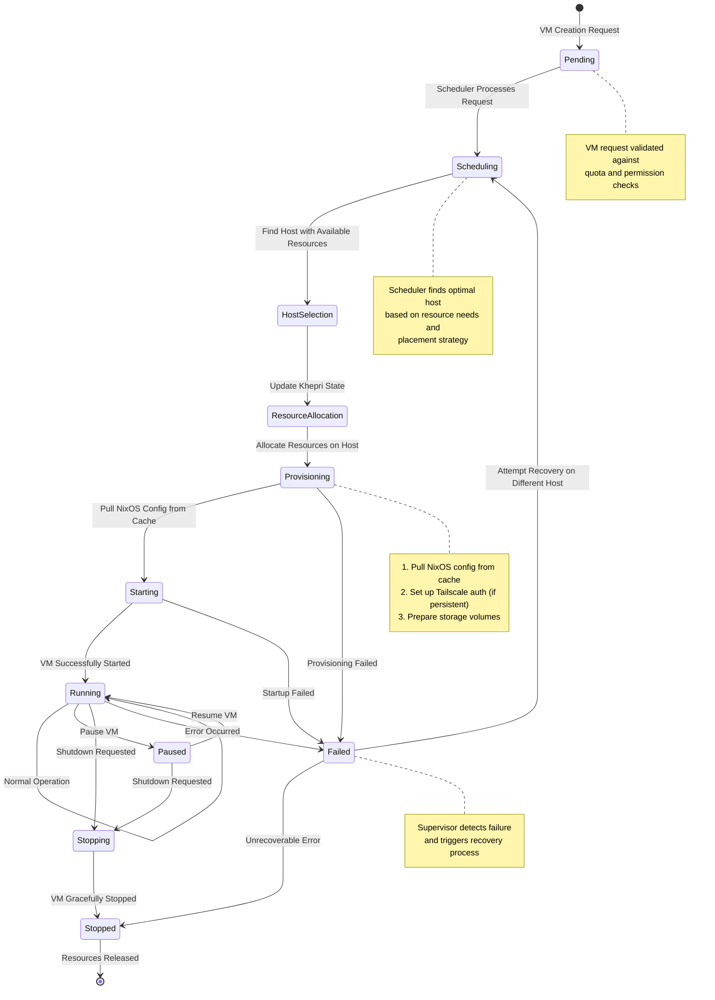

# Blixard - a NixOS microvm orchestrator in Gleam

## Technology Stack Overview

Our microVM orchestrator leverages a unique combination of technologies:

* **Gleam** - A statically typed functional language that runs on the BEAM VM
* **Khepri** - A tree-structured, replicated database with RAFT consensus
* **NixOS** - Declarative configuration for microVM definitions
* **microvm.nix** - NixOS module for creating and managing microVMs
* **Tailscale** - Secure network mesh for microVM connectivity

### Why This Stack?

This technology combination provides unique advantages:

1. **Type Safety with BEAM Power**: Gleam gives us static typing while retaining BEAM's concurrency and fault tolerance
2. **Elegant State Management**: Khepri's tree structure maps naturally to orchestration resources
3. **Declarative Infrastructure**: NixOS provides reproducible, declarative VM definitions
4. **Built-in Distribution**: The BEAM VM handles many distributed system challenges automatically
5. **Secure Networking**: Tailscale provides encrypted, identity-based networking

### Why Gleam & BEAM Instead of Rust

While Rust was considered as an alternative implementation language, ultimately Gleam on the BEAM VM was chosen for several compelling reasons:

1. **Distribution Model**: The BEAM VM's actor model and built-in distribution capabilities are a perfect fit for an orchestration system. Erlang/OTP's "Let it crash" philosophy and supervision trees provide exceptional fault tolerance with significantly less code than would be required in Rust.

2. **Khepri Integration**: Khepri is a native BEAM library built by the RabbitMQ team. Using Gleam provides seamless integration without requiring FFI or complex bindings.

3. **Development Velocity**: Gleam gives us much of Rust's type safety while enabling faster prototyping and iteration. The orchestrator domain benefits more from rapid evolution than from absolute performance.

4. **Concurrency Model**: While Rust has excellent concurrency primitives, the BEAM VM's lightweight processes (millions possible) and built-in message passing are ideally suited for managing many concurrent VM lifecycles.

5. **Soft Real-time Guarantees**: The BEAM VM's preemptive scheduler provides soft real-time guarantees that help ensure the orchestrator remains responsive even under heavy load.

6. **Ecosystem Synergy**: Many monitoring, distributed tracing, and observability tools have first-class support for BEAM applications (it was built for telecom applications afterall!).

Rust still has clear advantages in certain areas (raw performance, memory efficiency, and strictest safety guarantees), but the overall architecture of an orchestration system aligns more naturally with the BEAM's strengths. The choice of Gleam over Elixir specifically gives us the best of both worlds: static typing with FP idioms with Rust derived syntax, while retaining full interoperability with the rich Erlang/OTP ecosystem.

## System Architecture

```mermaid
%%{init: {'theme': 'default', 'securityLevel': 'loose', 'flowchart': {'htmlLabels': true}, 'zoom': {'enabled': true, 'pan': true}}}%%
graph TD
    subgraph "Distributed BEAM Cluster"
        OrchestratorCore[Orchestrator Core]
        KhepriStore[Khepri Store]
        APIGateway[API Gateway]
        Scheduler[Scheduler]

        subgraph "Khepri Consensus"
            Khepri1[Khepri Node 1]
            Khepri2[Khepri Node 2]
            Khepri3[Khepri Node 3]
            
            Khepri1 --- Khepri2
            Khepri2 --- Khepri3
            Khepri3 --- Khepri1
        end
        
        DistributedSupervisor[Distributed Supervisor]
    end
    
    %% Tailscale Mesh Network
    subgraph "Tailscale Mesh Network" 
        TailNet[Tailnet Secure Overlay]
        Headscale[Headscale Control Server]
    end
    
    subgraph "Host Node 1"
        HostAgent1[Host Agent]
        VMSupervisor1[VM Supervisor]
        TSClient1[Tailscale Client]
        
        subgraph "MicroVMs 1"
            PVM1[Persistent VM 1]
            PVM2[Persistent VM 2]
            SVM1[Serverless VM 1]
            SVM2[Serverless VM 2]
        end
    end
    
    subgraph "Host Node 2"
        HostAgent2[Host Agent]
        VMSupervisor2[VM Supervisor]
        TSClient2[Tailscale Client]
        
        subgraph "MicroVMs 2"
            PVM3[Persistent VM 3]
            SVM3[Serverless VM 3]
            SVM4[Serverless VM 4]
        end
    end
    
    %% Core connections
    OrchestratorCore --- KhepriStore
    OrchestratorCore --- APIGateway
    OrchestratorCore --- Scheduler
    OrchestratorCore --- DistributedSupervisor
    
    %% Khepri connections
    KhepriStore --- Khepri1
    KhepriStore --- Khepri2
    KhepriStore --- Khepri3
    
    %% Tailscale connections and mesh communication
    DistributedSupervisor -.->|Connect to Tailnet| TailNet
    HostAgent1 -.->|Connect to Tailnet| TailNet
    HostAgent2 -.->|Connect to Tailnet| TailNet
    TSClient1 -.->|Join Tailnet| TailNet
    TSClient2 -.->|Join Tailnet| TailNet
    Headscale -.->|Manage Tailnet| TailNet
    
    %% Communication over Tailnet
    DistributedSupervisor -.->|Supervise over Tailnet| HostAgent1
    DistributedSupervisor -.->|Supervise over Tailnet| HostAgent2
    HostAgent1 <-.->|P2P Communication| HostAgent2
    
    %% Host internals
    HostAgent1 --- VMSupervisor1
    HostAgent1 --- TSClient1
    
    HostAgent2 --- VMSupervisor2
    HostAgent2 --- TSClient2
    
    %% VM supervision
    VMSupervisor1 -.->|Manage| PVM1
    VMSupervisor1 -.->|Manage| PVM2
    VMSupervisor1 -.->|Manage| SVM1
    VMSupervisor1 -.->|Manage| SVM2
    
    VMSupervisor2 -.->|Manage| PVM3
    VMSupervisor2 -.->|Manage| SVM3
    VMSupervisor2 -.->|Manage| SVM4
    
    %% VM Network Access via Tailscale
    PVM1 -.->|Network via| TSClient1
    PVM2 -.->|Network via| TSClient1
    SVM1 -.->|Network via| TSClient1
    SVM2 -.->|Network via| TSClient1
    
    PVM3 -.->|Network via| TSClient2
    SVM3 -.->|Network via| TSClient2
    SVM4 -.->|Network via| TSClient2
    
    %% API access
    Client[API Client]
    Client -->|HTTP| APIGateway
    
    %% Color coding
    classDef gleam fill:#FFB5DA,color:black,stroke:#FF44AA,stroke-width:1px
    classDef khepri fill:#7C8EFA,color:white,stroke:#3A54F2,stroke-width:1px
    classDef beam fill:#11DD7C,color:black,stroke:#00AA50,stroke-width:1px
    classDef persistent fill:#4CAF50,color:white,stroke:#2E7D32,stroke-width:1px
    classDef serverless fill:#FF9800,color:white,stroke:#E65100,stroke-width:1px
    classDef tailscale fill:#005DD5,color:white,stroke:#003B88,stroke-width:2px
    
    class OrchestratorCore,Scheduler,APIGateway,HostAgent1,HostAgent2,VMSupervisor1,VMSupervisor2,DistributedSupervisor gleam
    class KhepriStore,Khepri1,Khepri2,Khepri3 khepri
    class TSClient1,TSClient2 beam
    class PVM1,PVM2,PVM3 persistent
    class SVM1,SVM2,SVM3,SVM4 serverless
    class TailNet,Headscale tailscale
```

## MicroVM Lifecycle Management

## Key Components

### 1. Gleam Domain Models

The core domain models represent the fundamental entities in our system:

- **MicroVM**: Defines a microVM instance with its resources, networking, and storage
- **Host**: Represents a physical or virtual machine running the host agent
- **Network Configuration**: Defines how VMs connect to networks
- **Storage Configuration**: Defines storage volumes for VMs

### 2. Khepri Store

The distributed state store provides:

- Consistent view of system state across all nodes
- Transaction support for atomic operations
- Tree-structured data model that maps naturally to our domain
- Consensus-based replication for high availability

### 3. Scheduler

The scheduler is responsible for:

- Placing VMs on suitable hosts based on resource requirements
- Enforcing constraints and affinities
- Optimizing resource utilization
- Handling VM rescheduling on failures

### 4. NixOS VM Manager

This component:

- Configures VMs from NixOS configuration stored on cache
- Manages VM lifecycle through systemd
- Handles network and storage setup
- Monitors VM health and performance

### 5. Tailscale Integration

The networking layer provides:

- Encrypted mesh networking between VMs
- Stable DNS and IPs for hosts with ephemeral IPs for VMs
- ACL Rule configuration
- Different network models for serverless vs. persistent VMs
  - Subnet Routing on serverless VMs, Tailscale client on persistent VMs

### 6. Host Agent

The host agent on each node:

- Runs as a supervised Gleam/OTP application
- Manages the VMs running on the host
- Reports resource usage and health
- Reconciles actual state with desired state

